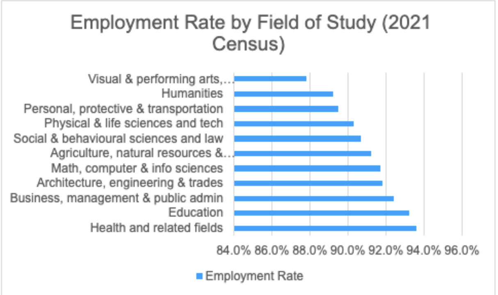
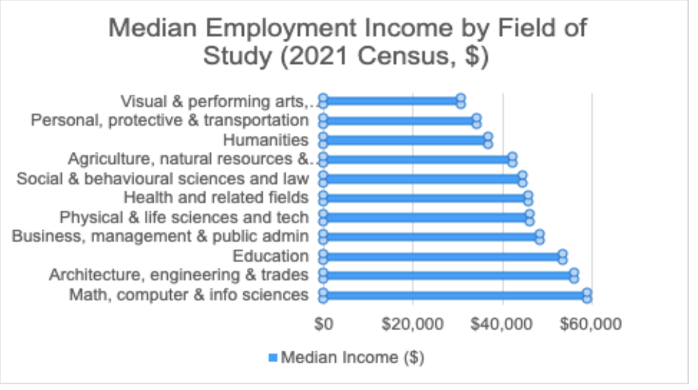
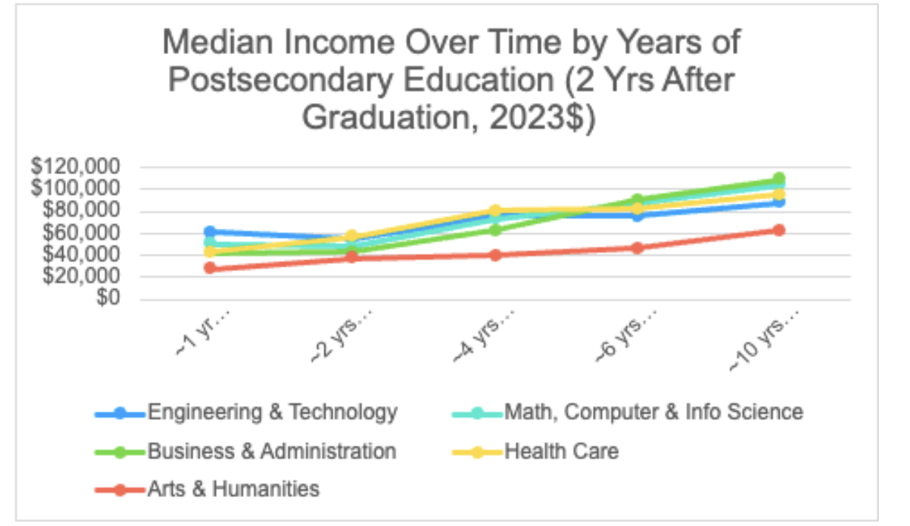
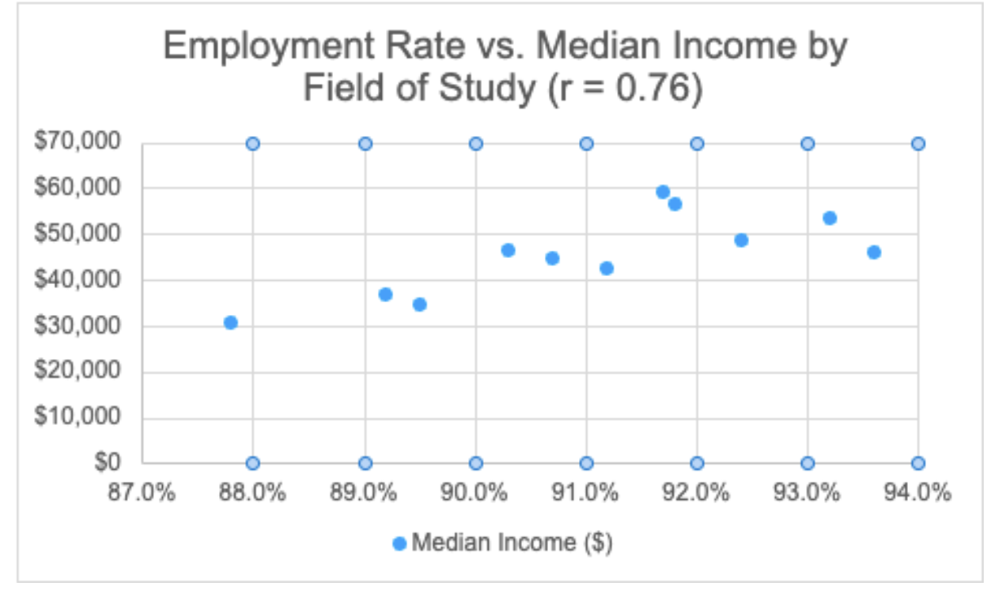

# Milestone 4: Final Analysis

## Research Question
If a student in Ontario wants strong early-career employment outcomes, which post-secondary field of study should they enroll in?

## Data Sources

This analysis uses three datasets:

- Labour Force Status by Field of Study (Employment Rate)
- Median Income by Field of Study
- Post-Graduation Income Over Time

These datasets were cleaned and structured to allow comparison across different fields of study.

## Visualizations

### 1. Employment Rate by Field of Study

### 2. Median Income by Field of Study

### 3. Income Growth Over Time

### 4. Employment Rate vs Income

## Key Insights

From the analysis, several clear patterns emerge:

- Health-related fields consistently show the highest employment rates, making them strong choices for job security.
- Engineering, technology, and math-related fields offer the highest median incomes and strong long-term earning growth.
- Business fields perform well across both employment and income, offering a balanced outcome.
- Arts and humanities fields tend to have lower employment rates and lower income outcomes in early careers.

  ## Final Recommendation

Students seeking strong early-career outcomes should prioritize fields that balance both employment stability and earning potential.

Based on the data, the strongest options are:

- Engineering and technology fields
- Math and computer science
- Health-related programs

These fields provide the best combination of high employment rates and strong income potential.

Students prioritizing stability should consider health-related fields, while those focused on maximizing income should consider engineering or technology paths.
